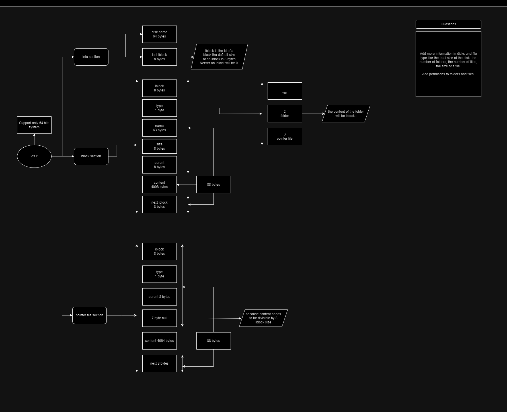

## UniVFS
# Status 
In development.

# Introduction
UniVFS is a project enfocated know more about development in C and making a module in C for NodeJS with Node-API (ABI).

Is basically a virtual file system where you will:

    * Create or load virual disks where inside you can:

        * Create files.

        * Create folders.

In the future:

    * Introduce file and folder permissions. 

# File system structure diagram

